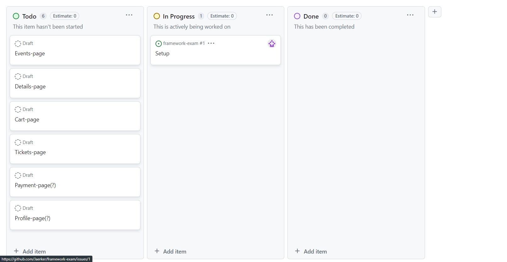

# Individuell examinationsuppgift 2024-04-29 - 2024-05-12

## Planering

Jag valde att dra igång en Github Project, även om jag är själv och jobbar på uppgiften, då det blir mycket enklare att hålla struktur på sig själv då, och tydligare se hur långt man kommit i projektet.

## Val av Hooks

Mina val av hooks är inte så utsvävande, till exempel:

* useState och useEffect - Vilket är ett krav för att få saker att fungera som det ska.
* useNavigate - Användbart för att navigera genom routes på sidan under vissa omständigheter, t.ex om du hamnar på en sida som du inte menat att vara på (efter ett köp och du försöker komma åt den sidan efteråt genom adressfältet) eller för att ordna knappars funktioner efter att ha utfört det de ska göra.
* useLocation - Använder denna egentligen endast för en anledning, och det är att kalla med en parameter mellan OrderPage och PurchaseCompletePage där jag vill ha med ID nummer för senaste köpet.
* useParams - För att kunna rigga upp info i DetailsPage.

Du kommer se en lite “onödig” store som heter pathStore som egentligen finns till för 2 syften:

* Den hjälper till med att kolla av om du gjort ett köp precis och ska hamna i /order/complete. Hamnar du på den adressen, men inte har rätt “path” så kommer du istället till en Error-sida*. Kan tillägga att här används även location.state för att ta med sig ID från OrderPage så jag kan visa det i en liten tabell.

>*Hade jag gjort mitt eget API så hade jag skött den hanteringen lite snyggare, men jag arbetar med det jag har till mitt förfogande!

* Den styr även en bakgrundsdetalj i App.jsx som ändrar bakgrunden för tickets med en liten animation.

## Val av Externa Bibliotek

Här har jag haft svårt att hitta något som skulle passa för denna uppgift. Men då jag ville använda mig av Font Awesomes ikoner när jag inte orkade göra egna så tog jag del av deras bibliotek via npm. Detta var väldigt smidigt att använda, mycket enklare än jag hade tänkt mig, och inte så svårt att styla till om man vill.

Axios tycker jag är väldigt bekvämt att använda också, men har lite att lära mig med det biblioteket tycker jag. Jag vill försöka göra det smidigare att hantera parametrar till API istället för att förlänga adressen “manuellt”, och den lösningen finns säkert men jag har inte orkat söka för mycket inför denna uppgift.

## Sista ord

Jag hoppas uppgiften ser bra ut och att den uppfyller de krav som behövs för att få ett bra betyg!

### För mer information om själva uppgiften så hänvisar jag till [lärarens uppgifts-sida!](https://github.com/Santosnr6/react_ind-examination?tab=readme-ov-)
